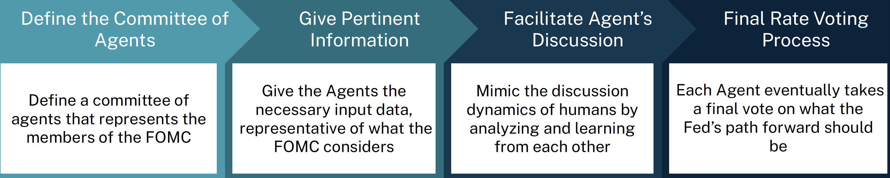
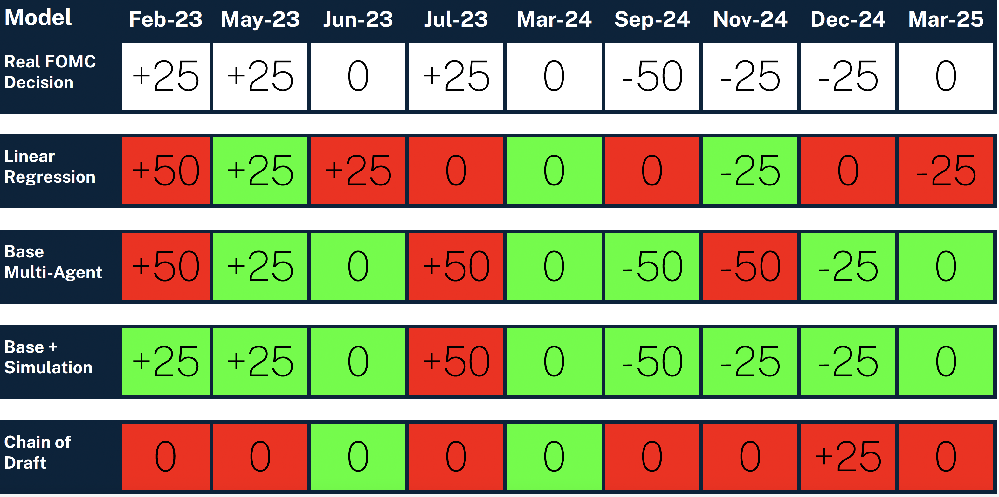

+++
title = "LLM FOMC Simulation: Developing Multi-Agent Frameworks for Federal Interest Rate Prediction"
template = "page.html"
date = 2025-02-05T15:00:00Z
[taxonomies]
tags = ["LLM", "multi-agent systems", "predictive modeling", "machine learning"]
[extra]
summary = "This project presents a multi-agent framework for simulating the Federal Open Market Committee (FOMC) decision-making process and predicting interest rate changes."
mathjax = "tex-mml"
+++

## Project Motivation

Predicting the Federal Funds Rate (FFR) is crucial for financial institutions like BNY, as it directly impacts net interest margin, liquidity, capital management, and foreign exchange market conditions. The Federal Open Market Committee (FOMC) plays a key role in determining rate changes, which are highly sensitive to economic data and political factors. However, accurately predicting and understanding the FOMC's decisions remains a challenge, particularly in forecasting the rate's direction.

This project explores the use of a multi-agent simulation framework to mimic the decision-making process of the FOMC. The goal is to predict interest rate changes and understand the factors that influence these decisions by simulating a group of agents representing FOMC members.

## Methodology

The project used a multi-agent system (MAS) to simulate the FOMC's decision-making process. Agents in the system represent the different members of the FOMC, each with distinct attributes such as political affiliation, tenure, and decision-making style. The system incorporates both structured data (e.g., inflation rates, economic growth) and unstructured data (e.g., Beige Book insights, individual voting behaviors) to inform the agents' decisions.

### Key Components of the Framework:
- **Clustering**: Agents are grouped based on similar decision-making characteristics (e.g., "Regional Pragmatists" vs. "Academic Balancers").
- **Base Model**: A sequential model simulating the voting process and decision-making of agents.
- **Simulations**: The agents simulate discussions and interactions to reach a consensus on rate changes.
- **Chain of Draft**: A prompt-engineered technique where agents iterate over various potential policy scenarios and narrow down the options through discussion.

The basic process is as follows and is implemented in CrewAI:

## Results

### Backtesting & Evaluation:
The model was tested with historical FOMC meetings, simulating decisions for rate hikes, cuts, and holds. The performance of the multi-agent model was compared against baseline models, such as linear regression, to evaluate accuracy in predicting rate changes.

- **Linear Regression**: 57.14% accuracy in correctly predicting rate changes.
- **Multi-Agent System (Base)**: Significant improvement in accuracy, with a 56% increase over the baseline.
- **Chain of Draft Simulation**: Further enhancements in voting accuracy, with stability metrics showing 70-80% consistency in agent decisions across simulations.

The best performing framework was the base + simulation for long term memory architecture: 

### Key Findings:
- Simulations improved the accuracy of rate predictions compared to traditional quantitative models.
- Multi-agent systems provide a more nuanced understanding of FOMC decision-making, capturing interpersonal dynamics among members.
- The use of "Chain of Draft" prompting allowed agents to improve decision-making time, but failed to reach the same level of accuracy with using simulation for long-term memory. 

## Conclusion

This study successfully developed a multi-agent framework to simulate FOMC decision-making and predict Federal Funds Rate changes. The framework showed promising results, especially when incorporating simulations for longterm memory. The ability of the model to replicate FOMC dynamics could be a valuable tool for financial institutions like BNY, helping them better anticipate rate decisions and manage risks accordingly.

By laying the groundwork for further refinement and incorporating additional data, this approach could evolve into a robust predictive tool for FOMC decisions, enhancing the strategic decision-making capabilities of financial firms.

## Github Repo & Presentation 

[Github link](https://github.com/adlerviton/BNY_Crew_FOMC_Simulator)  

<iframe src="../BNYPresentation.pdf" width="100%" height="600" scrolling="no" frameborder="0" webkitallowfullscreen mozallowfullscreen allowfullscreen></iframe>
