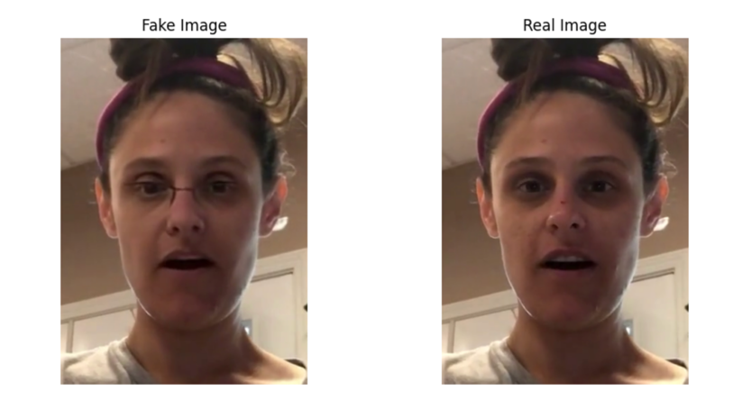
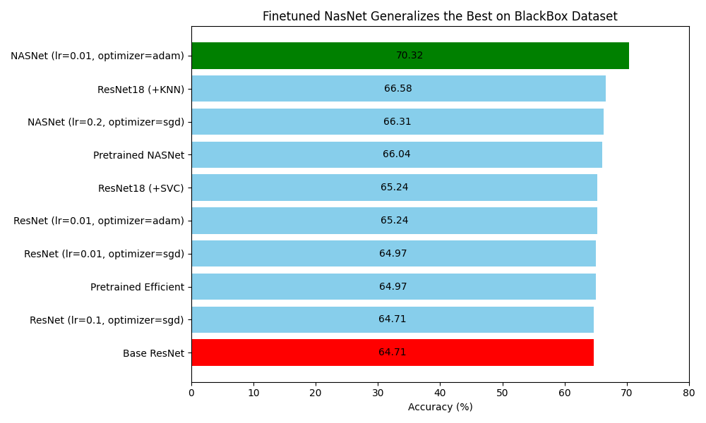

+++
title = "DeepFake Video Detection"
template = "page.html"
date = 2024-12-15T15:00:00Z
[taxonomies]
tags = ["image detection", "machine learning", "deep learning"]
[extra]
summary = "A study on deepfake video detection, evaluating transfer learning, fine-tuning, and model generalization across two datasets, DFDC and FakeAVCeleb."
mathjax = "tex-mml"
+++

## Project Motivation

Detecting deepfake images and videos is becoming increasingly challenging due to various deepfake techniques (e.g. GANs, diffusion models). By evaluating baseline, pretrained, and fine-tuned models across the DFDC and FakeAVCeleb datasets, we aim to understand how well these models generalize to unseen data distributions. Our goal is to investigate model performance, identify the best architectures for deepfake detection, and assess the impact of hyperparameter tuning and post-hoc enhancements like KNN and SVM classifiers.

### Challenge of Generalization

The increasing sophistication of deepfake generation methods, such as those used by <cite>Meta[^1]</cite>, has led to difficulties in detecting manipulated images through traditional methods. This study aims to address the challenge of creating models that can effectively detect deepfakes across different datasets and generation methods, focusing on the ability of deep learning models to generalize to unseen data. Achieving this generalization is vital for real-world applications, where models must perform reliably across a variety of manipulated content.

[^1]: [DFDC Dataset by Meta](https://ai.meta.com/datasets/dfdc/)

## Methodology

We preprocessed the DFDC and <cite>FakeAVCeleb[^2]</cite> datasets, focusing on extracting and aligning facial regions from deepfake videos. We employed several deep learning models, including ResNet-18, NASNetLarge, and EfficientNet, using transfer learning and fine-tuning techniques to adapt pretrained models to our task. Models were further tested for their generalization capabilities using a black-box dataset, providing a robust evaluation of their real-world applicability.

[^2]: [FakeAVCeleb Dataset by DashLab](https://sites.google.com/view/fakeavcelebdash-lab/)

### Techniques:
- **Preprocessing and Data Augmentation**: Facial regions were detected and cropped using MTCNN, and data augmentation techniques like mirroring and color jittering were applied.
- **Transfer Learning**: Models were pretrained on ImageNet, then fine-tuned with the DFDC dataset for deepfake detection.
- **Alternative Classification Methods**: KNN and SVM classifiers were used with embeddings from the neural network models.
- **Hyperparameter Tuning**: Experiments involved adjusting learning rates and optimizing architectures, particularly focusing on SGD and Adam optimizers.

### Data Datasets

- **DFDC Dataset**: This dataset, provided by Meta, is used for training, validation, and testing the models. It includes a wide range of deepfake videos, generated using various techniques, making it ideal for training models for detection.
- **FakeAVCeleb Dataset**: This dataset, used for black-box testing, provides a new challenge with deepfakes generated through different methods and demographic representations. It was specifically chosen to evaluate how well models generalize to unseen datasets.

## Results

Fine-tuning outperformed frozen transfer learning for most models. EfficientNet fine-tuned with SGD achieved the highest accuracy of 77.16% on the holdout set, while NASNetLarge outperformed the baseline by 6% on the black-box dataset, with a 70.32% accuracy. Despite these gains, significant performance drops were observed on the black-box dataset due to distributional shifts.

### Performance Insights:
- **Best Model**: EfficientNet fine-tuned with SGD achieved the highest accuracy on the holdout set.
- **Generalization Issues**: Models struggled to generalize on the black-box dataset, highlighting challenges in deepfake detection on unseen data.
- **Hyperparameter Impact**: Learning rates and optimization strategies played a crucial role in model performance, with lower learning rates generally yielding better results for complex models like EfficientNet and NASNetLarge.

### Comparison of Architectures:
- **ResNet-18**: The simplest model, which performed decently on the holdout dataset but struggled with generalization to the black-box dataset.
- **NASNetLarge**: Showed strong performance in fine-tuning but still faced significant challenges in generalization.
- **EfficientNet**: The most efficient model in terms of both training time and performance on the holdout set, but also showed substantial drops in performance on unseen data.

## Discussion & Conclusion

Fine-tuning was essential for achieving good performance, especially with NASNetLarge and EfficientNet. Transfer learning was only effective for NASNetLarge and EfficientNet when fine-tuned. However, models still struggled with generalization to unseen data, which is a key challenge in real-world applications. Despite these limitations, the study highlights the importance of careful hyperparameter tuning, particularly the use of lower learning rates for models with complex architectures like NASNetLarge and EfficientNet.

### The Role of Hyperparameter Tuning

Learning rates and optimization strategies were found to be critical for the models' performance. Lower learning rates were beneficial for models like EfficientNet and NASNetLarge, which have complex architectures and can easily overfit if training updates are too aggressive. Meanwhile, simpler models like ResNet-18 also benefitted from lower learning rates, as these models are more susceptible to overspecialization when trained on smaller datasets.

### Challenges of Generalization

The significant drop in performance when transitioning from the holdout set to the black-box dataset indicates that current deepfake detection models face challenges in generalizing to unseen deepfakes. This is particularly problematic in real-world scenarios, where deepfakes can vary greatly in generation techniques and characteristics. Future work should focus on improving model generalization through better feature extraction methods, robust training techniques, and expanded datasets.

### Future Work

The results from this study offer valuable insights into improving deepfake detection systems. Future research should focus on:
- **Enhanced Generalization**: Developing strategies to improve model robustness across a wide range of deepfake generation methods.
- **Alternative Architectures**: Exploring new architectures that can handle the diverse nature of deepfakes while being computationally efficient.
- **Larger Datasets**: Incorporating more diverse datasets for training, which could help the models better handle unseen manipulations in the data.

## Github Repo & Report

[Github link](https://github.com/jeremymtan/Deep_Fake_Image_Detection)  

<iframe src="../DL_DeepFake.pdf" width="100%" height="600" scrolling="no" frameborder="0" webkitallowfullscreen mozallowfullscreen allowfullscreen></iframe>