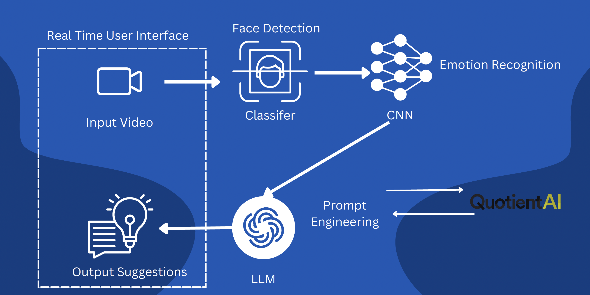
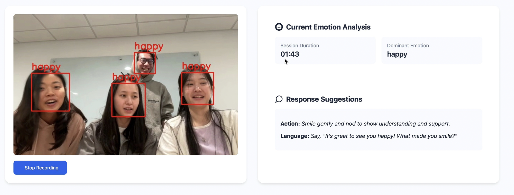

+++
title = "Alex and Mia: Real-Time Emotion-Processing App"
template = "page.html"
date = 2024-11-01T15:00:00Z
[taxonomies]
tags = ["emotion recognition", "real-time applications", "machine learning", "LLM"]
[extra]
summary = "3rd Place Duke AI Hackathon: Alex and Mia is a real-time emotion-processing app designed to assist individuals with Alexithymia in recognizing emotions and improving social interactions."
mathjax = "tex-mml"
+++

## Project Motivation

<cite>Alexithymia[^1]</cite>, also known as "emotional blindness," is a neuropsychological phenomenon where individuals have significant difficulty recognizing, expressing, sourcing, and describing their emotions. It is often associated with challenges in forming attachments and establishing interpersonal relationships. Approximately 1 in 10 people have Alexithymia, and many of them struggle in social interactions, particularly in the workplace. 

Emotions AI aims to support individuals with Alexithymia in recognizing emotions and providing immediate suggestions on how to respond, both in terms of language and actions. The application focuses on enhancing communication and inclusivity, helping individuals improve their social interaction skills in professional environments.

[^1]: [Alexithymia](https://pmc.ncbi.nlm.nih.gov/articles/PMC8456171/)

## Purpose

The goal of **Alex and Mia* is to create a real-time, emotion-processing app that helps users identify emotions in their environment and provide actionable suggestions on how to respond appropriately. Specifically designed for individuals who have difficulty recognizing others' emotions or expressing their own, this app can be an essential tool for fostering inclusion and improving interpersonal communication in the workforce.

## Methodology

The architecture of **Alex and Mia** involves real-time emotion detection using video input, leveraging deep learning technologies. The core components include:
- **Face Detection**: Identifying faces in real-time video to focus emotion analysis.
- **Emotion Recognition**: Using CNN-based models to classify emotions based on facial expressions.
- **Classifier**: The emotion is classified into predefined categories to generate the most relevant response.
- **Prompt Engineering**: Based on the detected emotion, the app generates actionable suggestions for users to improve their response in social settings.

## Responsible AI

In the development of **Alex and Mia**, we are committed to responsible AI usage:
- **Privacy**: The app ensures that users provide consent for real-time facial recognition, and no video data is stored.
- **Bias in Facial Recognition**: The models used are pretrained with a diverse dataset to minimize bias and ensure accurate emotion recognition across different demographics.
- **Suggestions, Not Substitutes**: The app provides suggestions, not definitive solutions, and cannot replace authentic social interactions. It aims to enhance social understanding and communication, not substitute genuine human connection.

## Conclusion

**Alex and Mia** is an  application designed to assist individuals with Alexithymia in recognizing emotions and improving their social interactions in the workplace. Through the use of real-time emotion recognition and AI-driven suggestions, the app enhances communication and provides a tool for individuals to thrive in professional environments.

## Github Repo, Devpost, and Presentation

[Github link](https://github.com/jeremymtan/DukeAIHackathon2024)  
[Devpost link](https://devpost.com/software/alex-anbd-mia)  

<iframe src="../dukeaihackathon2024.pdf" width="100%" height="600" scrolling="no" frameborder="0" webkitallowfullscreen mozallowfullscreen allowfullscreen></iframe>

